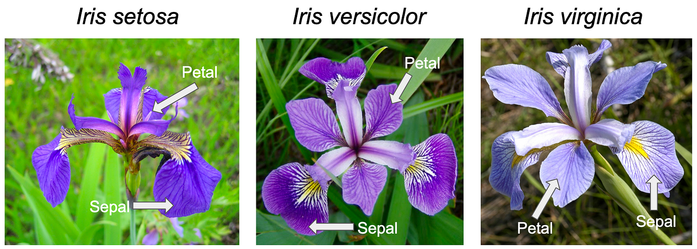

# Iris_Flower_Classification

Bu proje, Iris veri setini kullanarak üç farklı sınıflandırma modelinin (Logistic Regression, K-Nearest Neighbors (KNN) ve Decision Tree) performansını karşılaştırmayı amaçlamaktadır. Veri seti, 3 farklı Iris çiçeği türünü (Setosa, Versicolor, Virginica) sınıflandırmak için kullanılan 4 özellik (sepal length, sepal width, petal length, petal width) içerir.

Proje Adımları

1) Veri Yükleme ve Ön İşleme:
Iris veri seti scikit-learn kütüphanesinden yüklenmiştir.
Veri seti üzerinde temel keşifçi veri analizi (EDA) ve görselleştirmeler yapılmıştır.

2) Veri Görselleştirme ve Keşifçi Veri Analizi (EDA):
Veri setindeki temel özellikler ve ilişkiler görselleştirilmiştir.
Histogram ve Scatter plot grafikleri ile veri setinin genel yapısı incelenmiştir.

3) Model Kurulumu:
Logistic Regression (Lojistik Regresyon), K-Nearest Neighbors (KNN), Decision Tree (Karar Ağacı) modelleri kurulmuştur.

4) Model Değerlendirme:
Modellerin doğruluk (accuracy) skorları karşılaştırılmıştır.
Her bir modelin performansı analiz edilmiştir.
